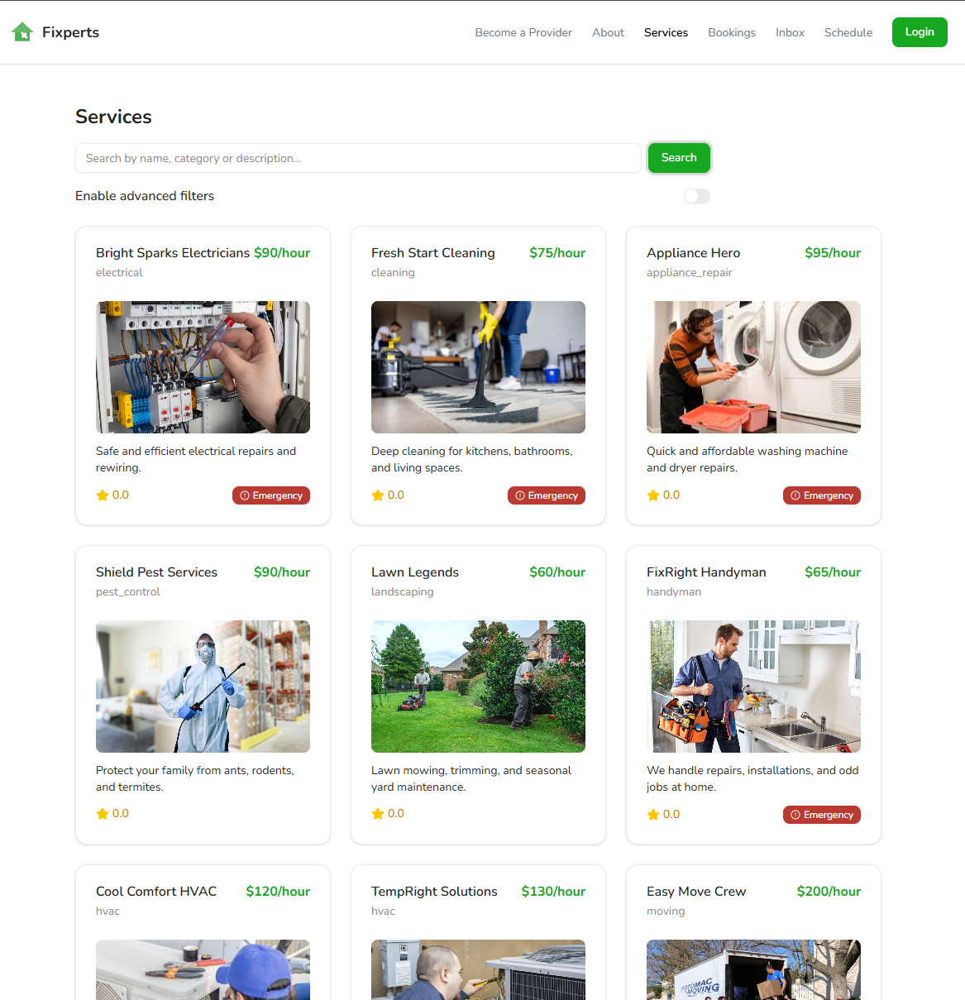
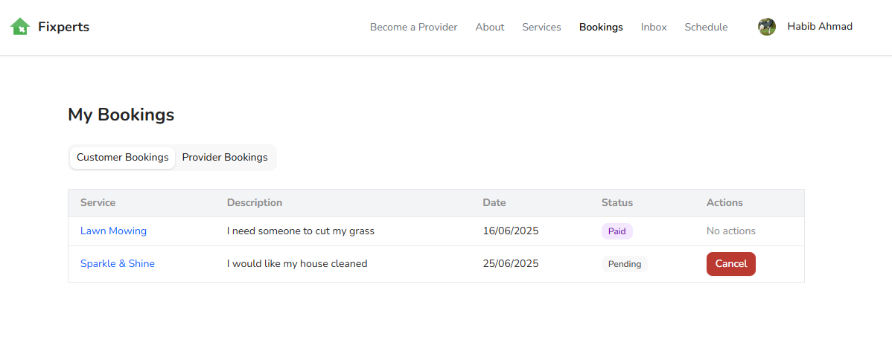
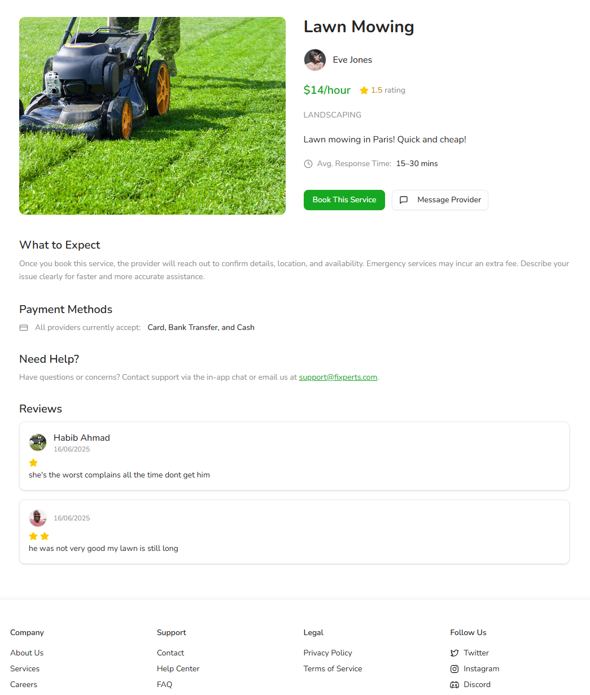
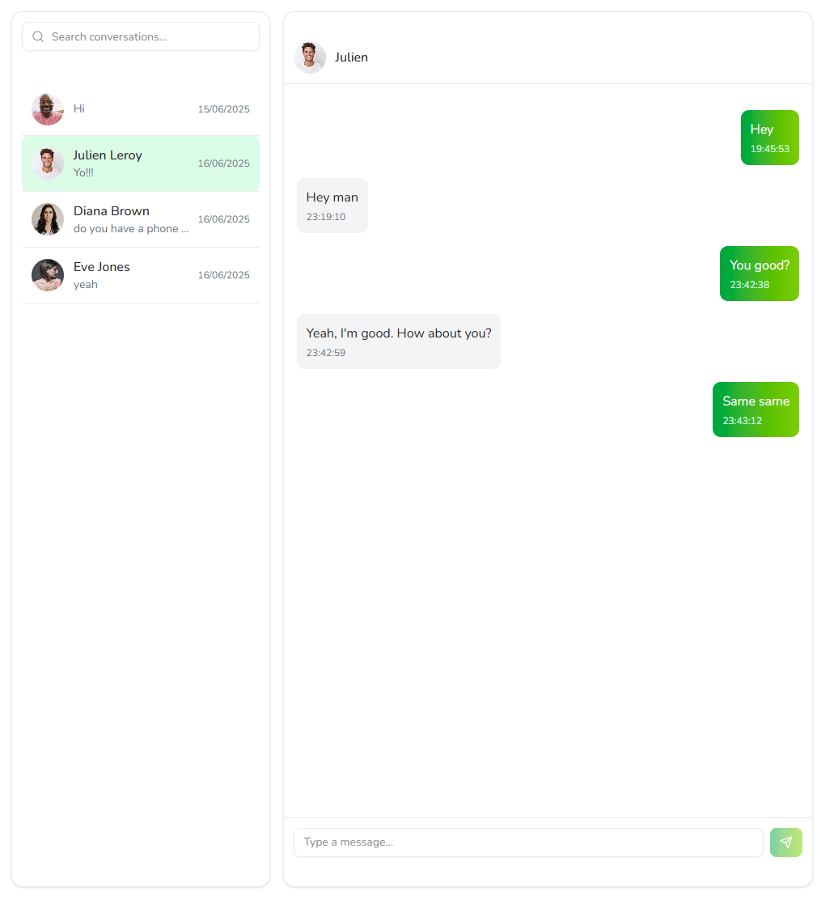

# Fixperts

**Fixperts** is a full-stack web platform that connects users with qualified local service providers such as handymen, electricians, plumbers, and cleaners.  
The platform allows users to browse available professionals, schedule regular or emergency bookings, communicate directly via in-app messaging, and track their service history.  
Service providers can manage their schedules through a built-in calendar, update availability, and interact with clients in real time.  
The goal of Fixperts is to simplify access to reliable home and maintenance services while offering providers an efficient way to manage their work.

- ### Live Demo: [https://fixperts.onrender.com](https://fixperts.onrender.com)

---

## Tech Stack

### Frontend

- [React](https://react.dev/) + [Vite](https://vitejs.dev/)
- [TypeScript](https://www.typescriptlang.org/)
- [TailwindCSS](https://tailwindcss.com/)

### Backend

- [Spring Boot](https://spring.io/projects/spring-boot)
- [MongoDB Atlas](https://www.mongodb.com/atlas) database
- WebSocket for real-time messaging and updates

---

## Core Features

- **Authentication & Roles:** secure login for users and service providers
- **Booking Calendar:** providers can view and manage booked dates
- **Emergency Bookings:** users can request urgent services when enabled by providers
- **In-App Messaging:** real-time chat between users and providers
- **Booking History:** users can review past and upcoming appointments
- **Responsive Interface:** optimized for both desktop and mobile
- **REST API + WebSocket:** full-stack integration between frontend and backend

---

## Project Structure

```

fixperts/
├── client/       # Frontend (Vite + React)
└── server/       # Backend (Spring Boot)

```

---

## Local Development

### Prerequisites

- Node.js 20+
- Java 21+
- Maven 3.9+
- MongoDB (local or Atlas)

### 1. Run the Backend

```bash
cd server
mvn spring-boot:run
```

Backend runs at [http://localhost:8081](http://localhost:8081)

### 2️. Run the Frontend

```bash
cd client
npm install
npm run dev
```

Frontend runs at [http://localhost:5173](http://localhost:5173)

Set API base in `client/.env`:

```env
VITE_API_URL=http://localhost:8081/api
VITE_MEDIA_BASE_URL=http://localhost:8081
```

---

## Deployment

- **Frontend:** deployed on → `https://fixperts.onrender.com`
- **Backend:** deployed on → `https://fixperts-api.onrender.com`

MongoDB Atlas handles database storage.

---

## Screenshots







---

## Authors

| Name               | GitHub                                               |
| ------------------ | ---------------------------------------------------- |
| **Ahmad Habib**    | [@Habib-Ahmad](https://github.com/Habib-Ahmad)       |
| **Bouchene Mehdi** | [@Bouchene-Mehdi](https://github.com/Bouchene-Mehdi) |
| **Kacper Janus**   | [@kjanus03](https://github.com/kjanus03)             |

---
